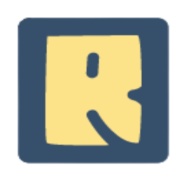

<div id="top"></div>


<!-- PROJECT LOGO -->
<br />
<div align="center">
  <a href="https://github.com/othneildrew/Best-README-Template">
    
  </a>

  <h3 align="center">RoyaltyFreePics</h3>

  <p align="center">
A searched based application for finding royalty free pictures using React Js & Unsplash api.
    <br />
    <a href="https://inquisitive-rabanadas-ebd503.netlify.app/">View Demo</a>

  </p>
</div>

<!-- PROJECT LOGO -->
<br />
<div align="center">

  
  </a>
</div>


</br>
</br>
<!-- TABLE OF CONTENTS -->
<details>
  <summary>Table of Contents</summary>
  <ol>
    <li>
      <a href="#about-the-project">About The Project</a>
      <ul>
        <li><a href="#built-with">Built With</a></li>
      </ul>
    </li>
    <li>
      <a href="#getting-started">Getting Started</a>
      <ul>
        <li><a href="#prerequisites">Prerequisites</a></li>
        <li><a href="#installation">Installation</a></li>
      </ul>
    </li>
    <li><a href="#usage">Usage</a></li>
    <li><a href="#roadmap">Roadmap</a></li>
    <li><a href="#contributing">Contributing</a></li>
    <li><a href="#license">License</a></li>
    <li><a href="#contact">Contact</a></li>
    <li><a href="#acknowledgments">Acknowledgments</a></li>
  </ol>
</details>


<!-- ABOUT THE PROJECT -->
## About The Project

A searched based application for finding royalty free pictures using React Js & Unsplash api.

Use the `readme.md` to get started.

<p align="right">(<a href="#top">back to top</a>)</p>


### Built With

This section lists any major frameworks/libraries used to build the project. 
For detailed information refer to the package.json 
file.


* [React.js](https://reactjs.org/)
* [Vite](https://vitejs.dev/)


<p align="right">(<a href="#top">back to top</a>)</p>


<!-- GETTING STARTED -->
## Getting Started

Follow the steps below to get started with the project.

### Prerequisites


* npm
  ```sh
  npm install npm@latest -g
  ```

### Installation

_Below is an example of how you can instruct your audience on installing and setting up your app. This template doesn't rely on any external dependencies or services._

1. Get a free API Key for Unsplash at [https://unsplash.com/developers](https://example.com)
2. Clone the repo
   ```sh
   git clone https://github.com/your_username_/Project-Name.git
   ```
3. Install NPM packages
   ```sh
   npm install
   ```
4. Enter your API in `App.jsx`
   ```js
   const Access_Key = 'ENTER YOUR API';
   ```

<p align="right">(<a href="#top">back to top</a>)</p>


<!-- LICENSE -->
## License

Distributed under the MIT License. See `LICENSE.txt` for more information.

<p align="right">(<a href="#top">back to top</a>)</p>


<!-- CONTACT -->
## Contact

Sameed Zahoor - [@Linkedin](https://www.linkedin.com/in/sameed-zahoor-970954226/) - sameedzahoor.contact@gmail.com


<p align="right">(<a href="#top">back to top</a>)</p>

